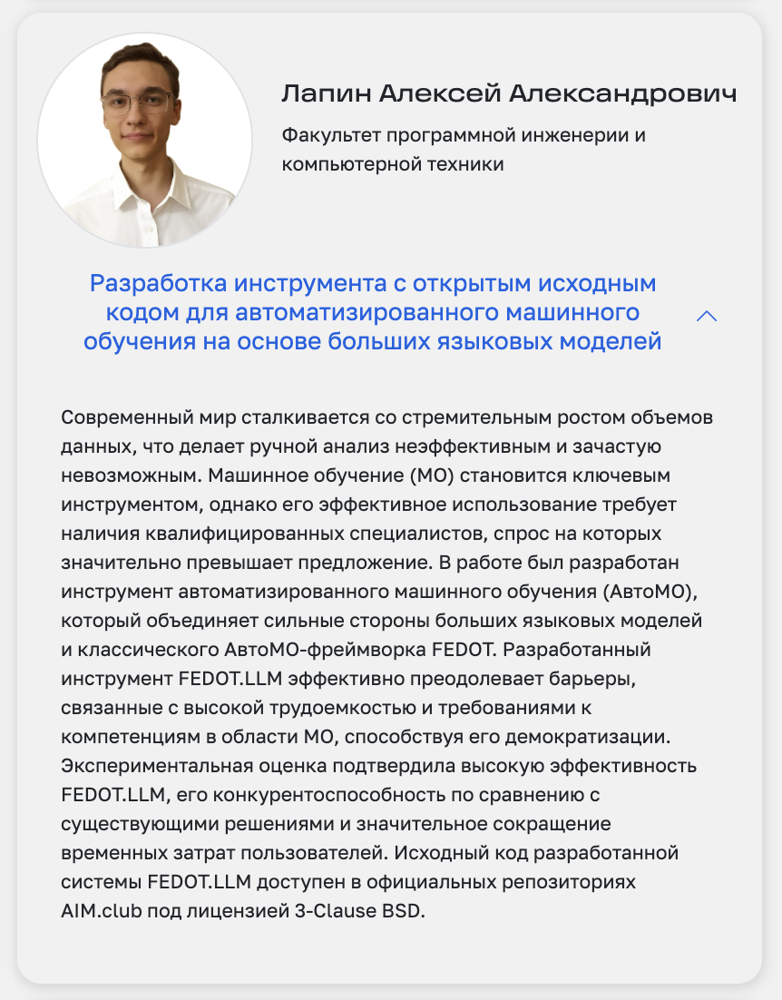

# Последний год бакалавриата ИТМО <br> Системное и прикладное программное обеспечение

## Практики
### Учебная
| Место прохождения практики: 	|                                                                                                                                                                                                                                                                                                                	|
|-----------------------------	|----------------------------------------------------------------------------------------------------------------------------------------------------------------------------------------------------------------------------------------------------------------------------------------------------------------	|
| Место:                      	| факультет программной инженерии и компьютерной техники федеральное государственное автономное образовательное учреждение высшего образования «Национальный исследовательский университет ИТМО» (Университет ИТМО) (инн: 7813045547) (адрес: 197101, г. Санкт-Петербург, Кронверкский проспект, дом 49, лит. А) 	|
| Период:                     	| с 21.02.2025 по 07.03.2025                                                                                                                                                                                                                                                                                     	|

- [[Отчёт]](./Educational_Practice/Отчет_ЛапинАА.pdf)


### Производственная
| Место прохождения практики: 	|                                                                                                                                                                                                                                                                                                                                                                      	|
|-----------------------------	|----------------------------------------------------------------------------------------------------------------------------------------------------------------------------------------------------------------------------------------------------------------------------------------------------------------------------------------------------------------------	|
| Место:                      	| исследовательский центр в сфере искусственного интеллекта "Сильный искусственный интеллект в промышленности" федеральное государственное автономное образовательное учреждение высшего образования «Национальный исследовательский университет ИТМО» (Университет ИТМО) (инн: 7813045547) (адрес: 197101, г. Санкт-Петербург, Кронверкский проспект, дом 49, лит. А) 	|
| Период:                     	| с 10.03.2025 по 30.04.2025                                                                                                                                                                                                                                                                                                                                           	|
- [[Отчёт]](./Industrial_Practice/Отчет_Производственная_Практика_ЛапинАА.pdf)


### Преддипломная
| Место прохождения практики: 	|                                                                                                                                                                                                                                                                                                                	|
|-----------------------------	|----------------------------------------------------------------------------------------------------------------------------------------------------------------------------------------------------------------------------------------------------------------------------------------------------------------	|
| Место:                      	| факультет программной инженерии и компьютерной техники федеральное государственное автономное образовательное учреждение высшего образования «Национальный исследовательский университет ИТМО» (Университет ИТМО) (инн: 7813045547) (адрес: 197101, г. Санкт-Петербург, Кронверкский проспект, дом 49, лит. А) 	|
| Период:                     	| с 02.05.2025 по 30.05.2025                                                                                                                                                                                                                                                                                     	|
- [[Отчёт]](./Pre-Graduation_Practice/Отчет_Преддипломная_Практика_ЛапинАА.pdf)


## Bachelor-Thesis
- [[Презентация]](./Thesis_Defense/ВКР_ЛапинАА_Презентация.pdf)
- [[Текст ВКР]](./Thesis_Defense/ВКР_ЛапинАА.pdf)
- [[Антиплагиат]](./Thesis_Defense/Certificate_20_20250519_Лапин_Алексей_Александрович.pdf)
- [[Исходный код]](https://github.com/aimclub/FEDOT.LLM)


## [Научный эверест](https://studnauka.itmo.ru/everest/)
1. По итогам защиты ВКР ГЭК определяет финалистов среди выпускников бакалавриата и магистратуры по направлениям подготовки
2. Отбор победителей на образовательных структурных подразделениях

__Лучшая ВКР Факультета программной инженерии и компьютерной техники ИТМО__

<a href="https://studnauka.itmo.ru/everest/winners"></a>

- [[Аннотация]](./Научный_Эверест/annotation_bachelor_thesis.pdf)
- [[Диплом победителя]](./Научный_Эверест/Диплом_Научный_Эверест_ЛапинАА.pdf)

## [XIV Конгресс молодых ученых ИТМО](https://kmu.itmo.ru/ru)
<a href="https://kmu.itmo.ru/digests/article/15661"> </a>
```plaintext
Лапин А.А. (науч. рук. Никитин Н.О.) Разработка open-source инструмента автоматизированного машинного обучения с использованием больших языковых моделей // Сборник тезисов докладов конгресса молодых ученых. Электронное издание. – СПб: Университет ИТМО, [2025]. URL: https://kmu.itmo.ru/digests/article/15661
```
- [[Презентация]](./КМУ-Технологии%20искусственного%20интеллекта/КМУ%20-%20FEDOTLLM.pdf)
- [[Тезис]](./КМУ-Технологии%20искусственного%20интеллекта/Тезис_Лапин%20А.А._с%20подписями.docx)
- [[Диплом победителя]](./КМУ-Технологии%20искусственного%20интеллекта/Диплом%20№%202514143%20За%20лучший%20доклад%20МУ%20(КМУ%202025)%20-%20Лапин%20Алексей%20Александрович.pdf)

## [JMLC](https://ai.itmo.ru/junior_ml_contest)
Конкурс ML-проектов от AI Talent Hub
- [[Подробнее о конкурсе]](https://ai.itmo.ru/junior_ml_contest)

- [[CV]](./JMLC/Aleksei_Lapin_CV.pdf)
- [[Презентация]](./JMLC/JMLC_Презентация.pdf)
- [[Мотивационное письмо]](./JMLC/Мотивационное_письмо.pdf)
- [[Описание проекта]](./JMLC/Описание_проекта_FEDOT.LLM.pdf)


## NSS Lab, Институт ИИ ИТМО
</a>

### Проекты
- [FEDOT.LLM](https://github.com/aimclub/FEDOT.LLM): LLM-based prototype for next-generation AutoML that combines the power of Large Language Models with automated machine learning techniques to enhance data analysis and pipeline building processes.
- [Fedot-assistant](https://github.com/AaLexUser/Fedot-assistant): multi-AutoML Orchestrator that leverages large language models (LLMs) to transform natural language task descriptions into configurations and automatically execute one of three supported
AutoML frameworks.
- [LightAutoDS-Tab](https://github.com/sb-ai-lab/LADS): multi-AutoML agentic system for tasks with tabular data, which combines an LLM-based code generation with several AutoML tools.

### Регистрация программы для ЭВМ:
- [Программный комплекс для решения задач автоматического машинного обучения с помощью больших языковых моделей Fedot.LLM : свидетельство о государственной регистрации программы для ЭВМ № 2024683108 / Никитин Н. О., Калюжная А. В., Лапин А. А., Лопатенко Г. В., Чумаков С. В., Соколов И. Д., Иов И. Л.](./Other/Gov_Registration_Certificate_Fedot.LLM_2024683108.pdf)
- [Библиотека инструментов для быстрого прототипирования систем ИИ на основе больших языковых моделей ProtoLLM.Core : свидетельство о государственной регистрации программы для ЭВМ № 2024690354 / Бухановский А. В., Никитин Н. О., Калюжная А. В., Насонов Д. А., Ковальчук М. А., Басилаев Д. И., Пискуровский М. Г., Лапин А. А., Воскресенский А. С., Каминский Ю. К., Першинов А. В., Подморин Д. О., Жидковская А. Б.](./Other/Gov_Registration_Certificate_ProtoLLM.Core_2024690354.pdf)

### Статьи
- [Lapin, A., Hromov, I., Chumakov, S., Mitrovic, M., Simakov, D., Nikitin, N. O., & Savchenko, A. V. (2025). LightAutoDS-Tab: Multi-AutoML Agentic System for Tabular Data. arXiv preprint arXiv:2507.13413.](https://arxiv.org/pdf/2507.13413)
- [Chumakov, S., Lapin, A., Gilemkhanov, D., Nikitin, N. O. FEDOT.LLM: Multi-Agent LLM-AutoML Framework for Better Automation of Data Science Tasks.](./Other/papers/FEDOTLLM.pdf)

### Ссылки на лабораторию
- [[Новостной канал лаборатории NSS Lab, Институт ИИ ИТМО.]](https://t.me/NSS_group)
- [[Канал сообщества ITMO OpenSource]](https://t.me/scientific_opensource)
- [[GitHub - Natural Systems Simulation Lab]](https://github.com/ITMO-NSS-team)
- [[GitHub - AIM.club, ITMO University]](https://github.com/aimclub)

---
# Другое
## [Хакатон AI-Learning Lab](https://ai-learninglab.itmo.ru/)
[[Подробнее о хакатоне]](https://ai-learninglab.itmo.ru/)

__Ecom.tech__

Разработка платформы разметки данных для повышения качества обучения нейронных сетей и внедрения современных AI моделей в пользовательские сервисы Самоката, Мегамаркета и Купера.
Решение должно позволить быстро и качественно размечать различные типы данных: текст, изображения, видео и многое другое.

### Видео
https://github.com/user-attachments/assets/2d56d049-ee47-401c-8217-e1fcaf2053e3


https://github.com/user-attachments/assets/dbafcca7-984b-4b5f-903a-5838499b208e


https://github.com/user-attachments/assets/ce4b0a42-249b-46f7-8e9b-fcc4617ae9c7


https://github.com/user-attachments/assets/56586ea8-9645-4e87-8ae1-399dd9e18602


- [[Презентация]](./AI-Learning-Lab/Сервис%20Разметки%20Данных%20DeepPick.pptx)
- [[Диплом победителя]](./AI-Learning-Lab/AILearningLab-Alexey.pdf)
- [[Исходный код]](https://github.com/AaLexUser/Data-annotation-service)

## [XIV Конгресс молодых ученых ИТМО](https://kmu.itmo.ru/ru)
<a href="https://kmu.itmo.ru/digests/article/15941"> </a>
```plaintext
Ермаков Т.С., Лапин А.А., Ри А.Р. (науч. рук. Кугаевских А.В.) Разработка сервиса разметки данных для обучения нейронных сетей // Сборник тезисов докладов конгресса молодых ученых. Электронное издание. – СПб: Университет ИТМО, [2025]. URL: https://kmu.itmo.ru/digests/article/15941
```
- [[Презентация]](./Other/КМУ-Программная%20инженерия%20и%20технологии/КМУ%20-%20DeepPick.pptx)
- [[Тезис]](./Other/КМУ-Программная%20инженерия%20и%20технологии/Тезис_Ермаков_Т_С_,_Лапин_А_А_,_Ри_А_Р_.docx)
- [[Диплом победителя]](./Other/КМУ-Программная%20инженерия%20и%20технологии/Диплом_№_2514342_За_лучший_доклад_МУ_КМУ_2025_Лапин_Алексей_Александрович.pdf)

